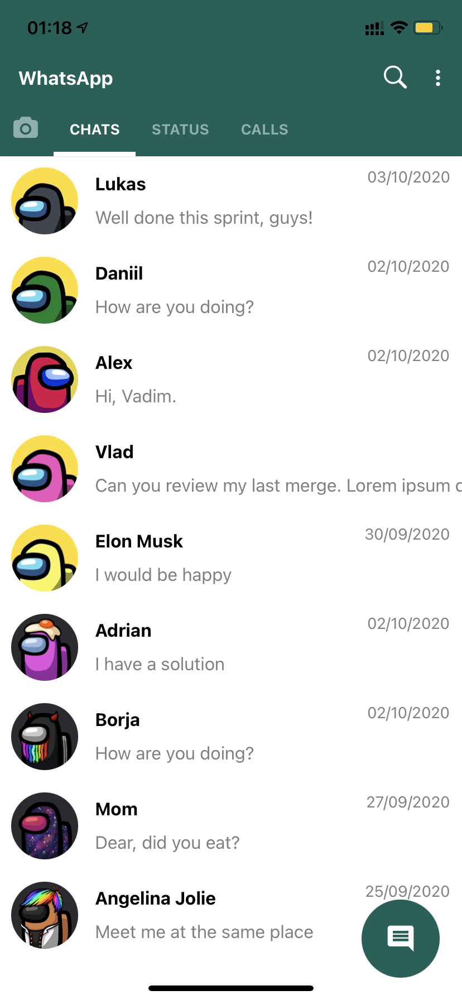
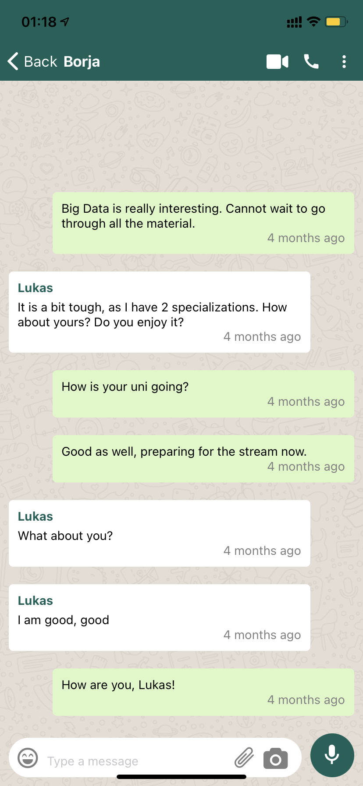

# rn-whatsapp-clone

|  |  |

### ✅ Realtime Demo 

⚽️ Install Expo Go from [App Store](https://apps.apple.com/ru/app/expo-go/id982107779?l=en) or [Google Play](https://play.google.com/store/apps/details?id=host.exp.exponent)

⚽️ Login to Expo App / ⚠️ Sometimes my app invite is needed

⚽️ Open url and scan QR code (if iOS by default camera, if Android by Expo App) 
https://expo.dev/@sanioka/rn-whatsapp-clone?serviceType=classic&distribution=expo-go

 

### How to build project

https://github.com/sanioka/rn-common

Plus custom settings: `amplify pull --appId d3udi498n7um79 --envName dev`

 

### Сourse author

@Vadim Savin / Build a Realtime Chat App in React Native (tutorial for beginners) 🔴 
https://www.youtube.com/watch?v=EvSUJ5lUcBw (frontend) 
https://www.youtube.com/watch?v=HdLbavvfflQ (backend) 
https://www.youtube.com/watch?v=Uq_vkUFnrss&t=1s (backend 2)

https://assets.notjust.dev/whatsapp

 